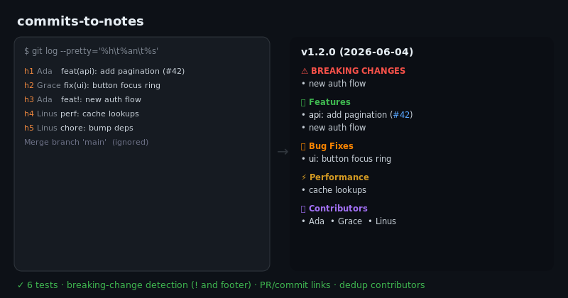

# commits-to-notes

[](https://github.com/JCreatesGH/commits-to-notes/actions)
[](https://www.typescriptlang.org/)
[](LICENSE)

Turn [Conventional Commits](https://www.conventionalcommits.org) into polished, grouped **release notes** — with breaking changes surfaced first, PR/commit links, and deduplicated contributor credits.



## Install

```bash
npm install commits-to-notes
```

## Use it (CLI)

```bash
git log --pretty='%h%x09%an%x09%s' v1.0.0..HEAD \
  | npx commits-to-notes v1.1.0 https://github.com/you/repo > NOTES.md
```

## Use it (library)

```ts
import { parseLog, renderNotes } from "commits-to-notes";

const md = renderNotes(parseLog(gitLog), {
  version: "v1.2.0",
  date: "2026-06-04",
  repoUrl: "https://github.com/you/repo",
});
```

## What it does

- **Parses** `type(scope)!: subject (#pr)` plus `BREAKING CHANGE:` footers; reads `hash` and `author` from a tab-separated `git log`.
- **Groups** into Features / Fixes / Performance / Refactors / Docs / Tests / Build / CI / Chores, with **breaking changes pulled to the top**.
- **Links** to PRs and commits when you pass a `repoUrl`.
- **Credits** every unique contributor, sorted.
- **Ignores** non-conventional lines (merges, WIP), so the output stays clean.

## Development

```bash
npm install && npm test    # 6 tests
npm run build              # tsc, clean
```

## License

MIT
